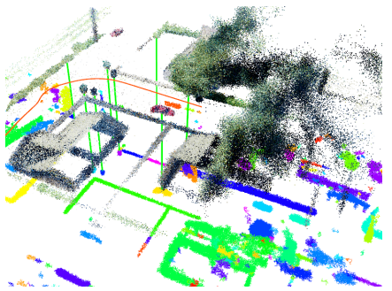
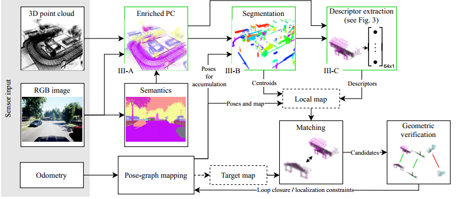

<!--
 * @Author: your name
 * @Date: 2022-03-30 09:01:29
 * @LastEditTime: 2022-03-31 15:53:53
 * @LastEditors: Please set LastEditors
 * @Description: 打开koroFileHeader查看配置 进行设置: https://github.com/OBKoro1/koro1FileHeader/wiki/%E9%85%8D%E7%BD%AE
 * @FilePath: \LearningNote\Livox lidar slam.md
-->
Livox lidar slam ：： google 搜索

大疆Livox Mid-40 SLAM
 
Livox 制图

https://github.com/Livox-SDK/livox_mapping 

## 硬件选型

### 计算平台
大疆RoboMaster妙算Manifold2-G-C高性能运算平台GPU Jetson TX2

### 算法

#### SemSegMap ：基于3D点云语义信息的定位

图1：此图显示正在运行的SemSegMap流程。SemSegMap能够在点云数据上执行基于分割的语义定位，该点云数据包含来自可视相机的语义和颜色信息，当前观察到的机器人周围的局部地图显示为下图所示的全局地图顶部的彩色点云，每个部分具有唯一的颜色。绿线表示定位的匹配分割对应部分，而橙色线表示机器人轨迹。

SemSegMap流程概览，整个流程可以在【从磁盘加载已经建立好的点云地图中进行的定位】的模式下运行，也可以在回环闭合模式下运行。

#### 基于PointPillars的点云三维目标检测和TensorRT

